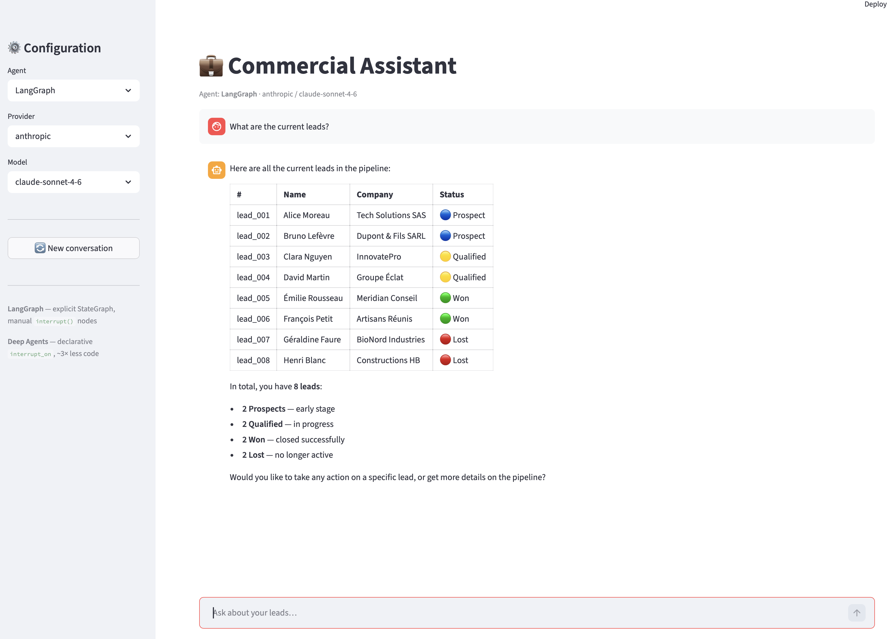
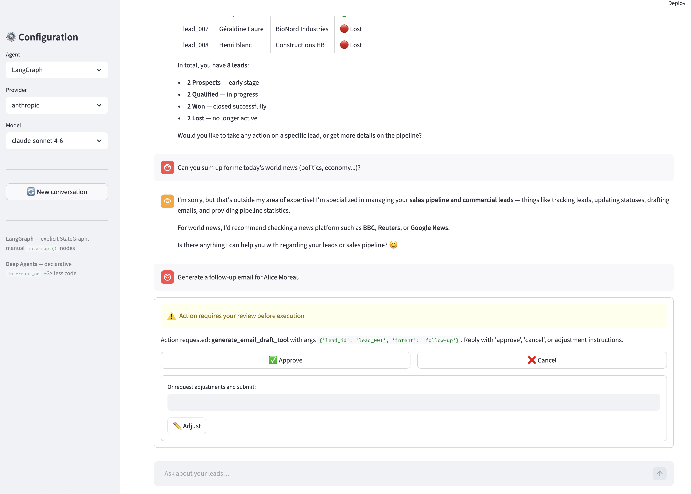
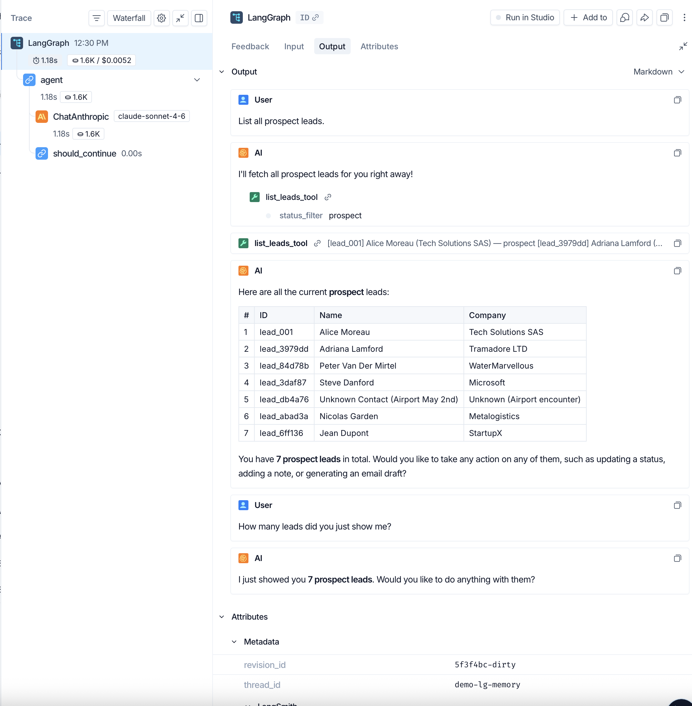
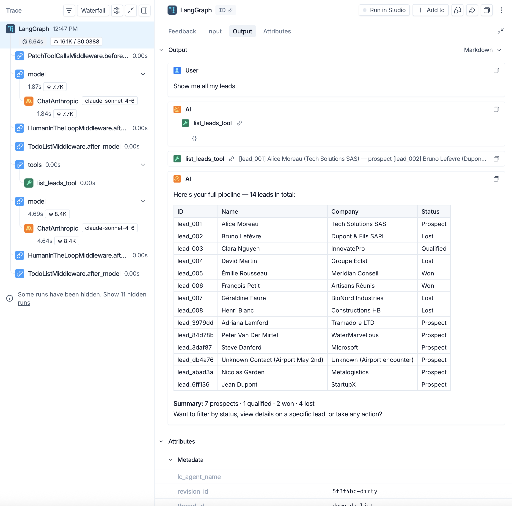
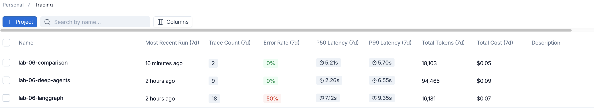

# Lab 06 — LangGraph vs Deep Agents

A commercial assistant agent for SME sales pipeline management, implemented twice:

- **LangGraph** — low-level explicit `StateGraph` with manual nodes, edges, and HITL
- **Deep Agents** — high-level declarative agent with `create_deep_agent()`

The lab demonstrates how the same functionality can be built at two levels of
abstraction, and compares developer experience, control flow visibility, HITL
granularity, and runtime behavior.

---

## Architecture

```text
06_langgraph_deep_agents/
├── app.py                      # Shared Streamlit chat interface
├── shared/
│   ├── leads_store.py          # CRUD on data/leads.json
│   ├── tools.py                # @tool-decorated wrappers (6 tools)
│   └── config.py               # get_llm(provider, model) factory
├── langgraph/
│   ├── agent/
│   │   ├── state.py            # AgentState TypedDict
│   │   └── agent.py            # StateGraph — nodes, edges, HITL via interrupt()
│   └── demo.ipynb
├── deep_agents/
│   ├── agent/
│   │   └── agent.py            # create_deep_agent() — declarative interrupt_on
│   └── demo.ipynb
├── comparison.ipynb            # Side-by-side analysis
├── data/
│   └── leads.json              # Versioned fictitious dataset (8+ leads)
└── tests/
    ├── unit/                   # leads_store, tools, config (22 tests)
    └── integration/            # LangGraph + Deep Agents scenarios (LLM mocked)
```

Both agents share the same `shared/` business logic and are exposed through
a single `app.py` with agent/provider/model selectors.

---

## Setup

**Requirements:** Python 3.13, [uv](https://docs.astral.sh/uv/)

```bash
cd 06_langgraph_deep_agents
uv sync --extra notebooks --extra dev
```

Create a `.env` file at the **repository root** (not the lab directory):

```env
ANTHROPIC_API_KEY=sk-ant-...
OPENAI_API_KEY=sk-...          # optional — OpenAI provider
GOOGLE_API_KEY=...             # optional — Google provider
LANGSMITH_API_KEY=ls__...      # optional — enables LangSmith tracing
```

---

## Running the Streamlit app

```bash
uv run streamlit run app.py
```

The sidebar lets you switch between agents (LangGraph / Deep Agents),
providers (Anthropic / OpenAI / Google), and models without restarting.

### Chat interface



### HITL review panel

When an action requires human approval, the chat pauses and a review panel
appears with Approve / Cancel / Adjust.



---

## Demo notebooks

Launch JupyterLab from the lab directory:

```bash
uv run jupyter lab
```

| Notebook | Content |
| --- | --- |
| `langgraph/demo.ipynb` | 6 scenarios with the LangGraph agent |
| `deep_agents/demo.ipynb` | Same 6 scenarios with the Deep Agents agent |
| `comparison.ipynb` | Code metrics, architecture, LangSmith traces, side-by-side test |

Each demo notebook activates LangSmith tracing (projects `lab-06-langgraph` and
`lab-06-deep-agents`). Run both before opening `comparison.ipynb`.

---

## Tests

```bash
# Unit tests only (no API calls)
uv run pytest tests/unit/ -v

# Integration tests (requires API keys)
uv run pytest tests/integration/ -m integration -v

# All non-integration tests
uv run pytest -m "not integration" -v
```

---

## Key concepts

### HITL — Human-in-the-Loop

Both agents pause before executing sensitive actions and wait for human approval.

| | LangGraph | Deep Agents |
| --- | --- | --- |
| Mechanism | `interrupt()` called inside `human_review_node` | Declarative `interrupt_on` dict |
| Granularity | Per-argument conditional (only `new_status='lost'`) | Per-tool (all calls) |
| Resume | `Command(resume={"decision": "approve"})` | `Command(resume={"decisions": [{"type": "approve"}]})` |

### Namespace package trick

The `langgraph` pip package has no `__init__.py` — it is a namespace package.
The local `langgraph/agent/` directory extends it transparently, so
`from langgraph.agent.agent import create_agent` resolves to the local
implementation without any `sys.path` hacks in production code.

Jupyter notebooks add the lab root to `sys.path` explicitly in their setup cell
since the kernel does not inherit the editable install's path automatically.

### LangSmith tracing

Set `LANGSMITH_API_KEY` in `.env` and tracing is automatic — no code changes needed
in `app.py` or the agent files. The demo notebooks set `LANGCHAIN_PROJECT`
explicitly to route traces to named projects.

#### LangGraph trace



#### Deep Agents trace



#### Token usage comparison



---

## Leads data model

```json
{
  "id": "lead_001",
  "name": "Alice Moreau",
  "company": "Tech Solutions SAS",
  "email": "a.moreau@techsolutions.fr",
  "status": "prospect",
  "notes": ["First contact via website form"],
  "created_at": "2026-04-01",
  "updated_at": "2026-04-01"
}
```

Valid status transitions: `prospect → qualified → won` or `prospect/qualified → lost`.

---

## Available tools

| Tool | Description | HITL |
| --- | --- | --- |
| `list_leads_tool` | List all leads, optionally filtered by status | No |
| `add_lead_tool` | Create a new lead | No |
| `add_note_tool` | Append a note to an existing lead | No |
| `update_lead_status_tool` | Update lead status (validates transitions) | LangGraph: only `→ lost` / Deep Agents: always |
| `generate_email_draft_tool` | Generate and save a follow-up email draft | Always |
| `get_pipeline_stats_tool` | Return counts per status | No |
