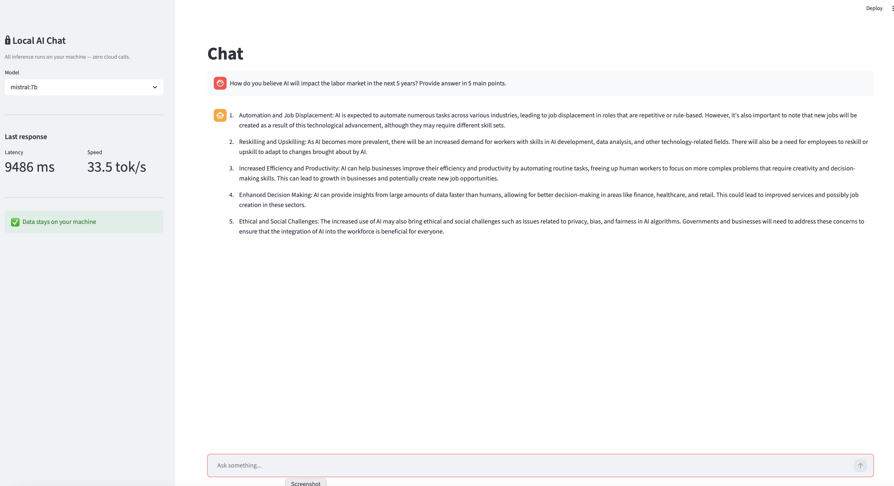
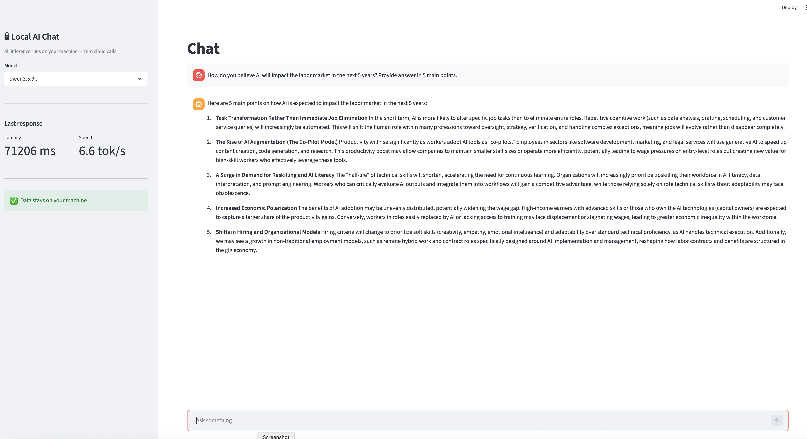
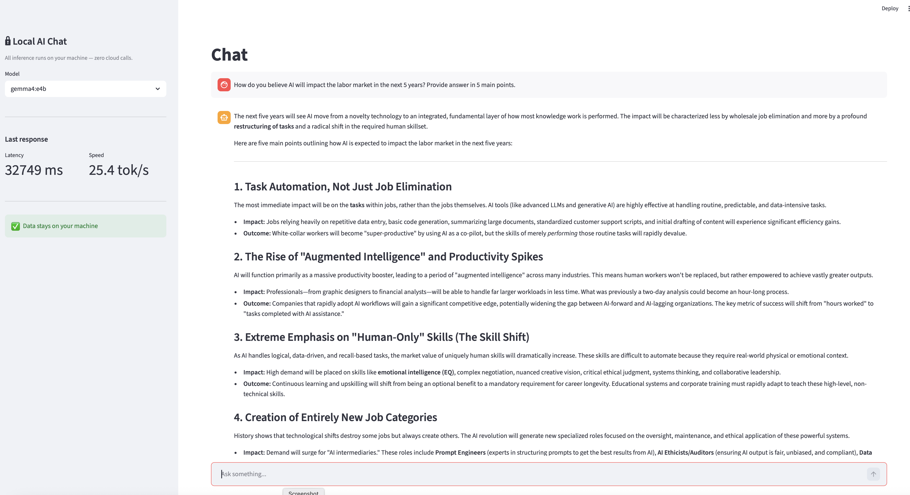

# Lab 07 — Local Models & Privacy-First AI

A fully offline AI engineering lab demonstrating that production-capable systems
(structured outputs, tool calling, vision, RAG) can be built without sending any
data to the cloud — and quantifying the trade-offs against cloud providers.

Every inference call in notebooks 01–05 stays on the local machine via
[Ollama](https://ollama.com). Notebook 06 connects to cloud APIs for comparison only.
The Streamlit app is 100 % local at runtime.

---

## What this lab covers

| Notebook | Topic |
| --- | --- |
| `01_ollama_setup.ipynb` | Ollama SDK, model management, streaming, OpenAI-compatible endpoint |
| `02_advanced_capabilities.ipynb` | Pydantic structured outputs, constrained decoding, 3-model compliance table |
| `03_tool_calling.ipynb` | 3 tools × 3 scenarios × 3 local models — agentic loop with `run_with_tools()` |
| `04_vision.ipynb` | Multimodal extraction with `gemma4:e4b` — invoice, org chart, dashboard |
| `05_local_rag.ipynb` | Full offline RAG: FAISS + `qwen3-embedding:0.6b` + `mistral:7b` |
| `06_benchmark.ipynb` | 6-model benchmark via LiteLLM — performance, quality, economics, data sovereignty |

---

## Architecture

```text
07_local_models_privacy_first/
├── README.md
├── pyproject.toml
├── .python-version              # 3.13.13
├── app/
│   ├── app.py                   # Streamlit entry point
│   └── chat.py                  # stream_response() + get_stats()
├── utils/
│   └── helpers.py               # check_ollama_running(), check_model_available(), chunk_text()
├── tests/
│   ├── unit/
│   │   ├── test_helpers.py      # chunk_text() unit tests
│   │   └── test_chat.py         # get_stats() unit tests
│   └── integration/
│       └── test_ollama.py       # Ollama connectivity + model availability
├── data/
│   ├── contoso_report_q4_2024.md        # Fictional confidential HR/financial report
│   ├── generate_vision_assets.py        # Generates vision test images with matplotlib
│   └── vision/
│       ├── invoice_sample.jpg
│       ├── org_chart.png
│       └── dashboard_screenshot.png
├── docs/
│   ├── assets/
│   │   ├── app_mistral-7b.png
│   │   ├── app_qwen3-5-9b.png
│   │   └── app_gemma4-e4b.png
│   └── specs/
│       └── 2026-05-12-07-local-models-privacy-first.md
├── 01_ollama_setup.ipynb
├── 02_advanced_capabilities.ipynb
├── 03_tool_calling.ipynb
├── 04_vision.ipynb
├── 05_local_rag.ipynb
└── 06_benchmark.ipynb
```

---

## Prerequisites

| Requirement | Notes |
| --- | --- |
| [Ollama](https://ollama.com) | Must be running (`ollama serve`) before launching notebooks or the app |
| [uv](https://docs.astral.sh/uv/) | Python package manager — replaces pip/venv |
| Python 3.13 | Managed automatically by uv via `.python-version` |

---

## Setup

```bash
cd 07_local_models_privacy_first
uv sync --extra notebook --extra dev
```

### Pull local models

```bash
ollama pull mistral:7b              # ~4 GB  — baseline LLM
ollama pull qwen3.5:9b              # ~6 GB  — tool calling and reasoning
ollama pull gemma4:e4b              # ~9.6 GB — vision + general purpose
ollama pull qwen3-embedding:0.6b    # 639 MB — embeddings (notebook 05)
```

### API keys (notebook 06 only)

Create a `.env` file at the **repository root** (not the lab directory):

```env
ANTHROPIC_API_KEY=sk-ant-...
OPENAI_API_KEY=sk-...
GEMINI_API_KEY=...
```

Notebooks 01–05 and the Streamlit app never read these keys.

---

## Streamlit app

```bash
uv run streamlit run app/app.py
```

A local chat interface with model selector, live token streaming, and response stats.
All requests stay on your machine — no network calls after the UI loads.

| `mistral:7b` | `qwen3.5:9b` | `gemma4:e4b` |
| --- | --- | --- |
|  |  |  |

**Sidebar panels:**

- Model selector — switch between the 3 local models without restarting
- Last response stats — latency (ms) and generation speed (tok/s)
- Data residency indicator — `✅ Data stays on your machine`

---

## Notebooks

```bash
uv run jupyter lab
```

Run them in order — each notebook is self-contained but notebooks 02–05 build on
concepts introduced in 01.

### Key results

| Dimension | Finding |
| --- | --- |
| Structured outputs | `qwen3.5:9b` and `gemma4:e4b` reliably follow JSON schemas; `mistral:7b` occasionally deviates without `format=` enforcement |
| Tool calling | `qwen3.5:9b` and `gemma4:e4b` score 3/3 scenarios; `mistral:7b` scores 2/3 |
| Vision | `gemma4:e4b` extracts invoice, org chart, and dashboard KPIs with high accuracy |
| RAG accuracy | All 3 local models answer 5/5 factual questions correctly on the Contoso report |
| Benchmark | Cloud models win on TTFT (~1 s vs 7–44 s); local models win on cost ($0.002/query electricity vs $0.010–$0.012) and data sovereignty |

---

## Tests

```bash
# Unit tests — no API calls, no Ollama required
uv run pytest tests/unit/ -v

# Integration tests — requires Ollama running with all models pulled
uv run pytest tests/integration/ -v

# All tests
uv run pytest -v
```

---

## Design decisions

| Decision | Rationale |
| --- | --- |
| **FAISS over ChromaDB** | Lab 05 already covers ChromaDB. FAISS is lower-level — no daemon, pure Python — and demonstrates understanding of the vector search layer beneath framework abstractions. |
| **qwen3-embedding:0.6b** | MTEB #1 multilingual leaderboard (May 2026), 32K context window vs 2K for nomic-embed-text, same model family as `qwen3.5:9b`. |
| **LiteLLM for benchmark** | One calling convention for all 6 models — avoids 3 separate native SDKs while keeping the comparison code uniform and the results comparable. |
| **No LangChain** | Lab 05 covers LangChain in depth. Lab 07 targets minimal dependencies, full offline operation, and maximum transparency — raw `faiss-cpu` + `ollama` SDK makes the pipeline explicit. |
| **Synthetic data** | `contoso_report_q4_2024.md` and the vision assets are programmatically generated with known ground-truth values, enabling deterministic evaluation in notebooks 04 and 05. |
