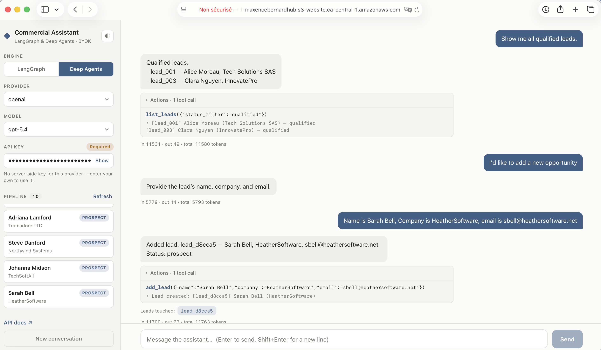
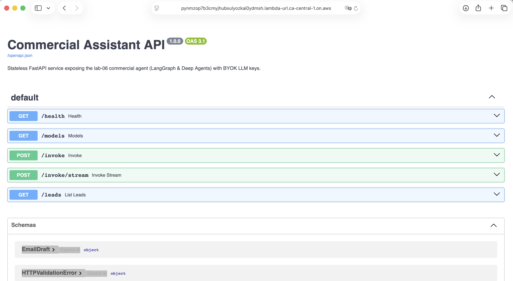
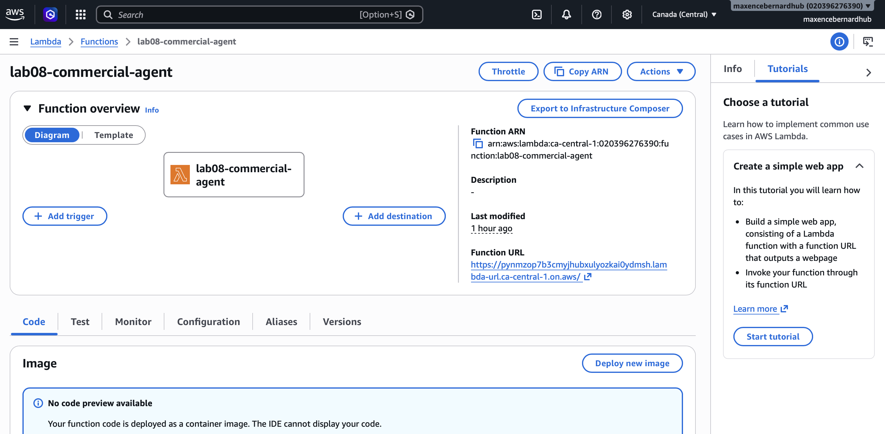
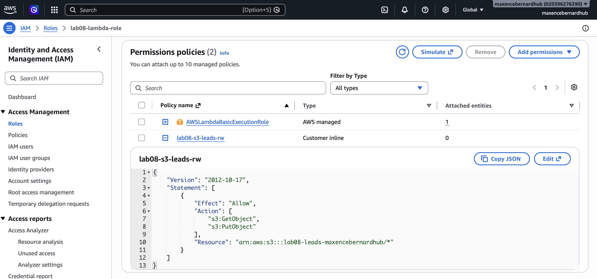
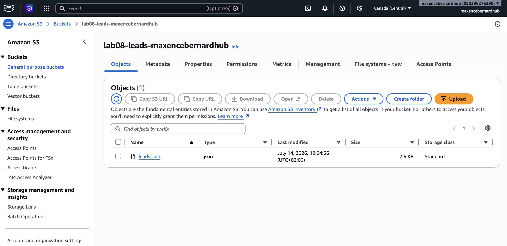
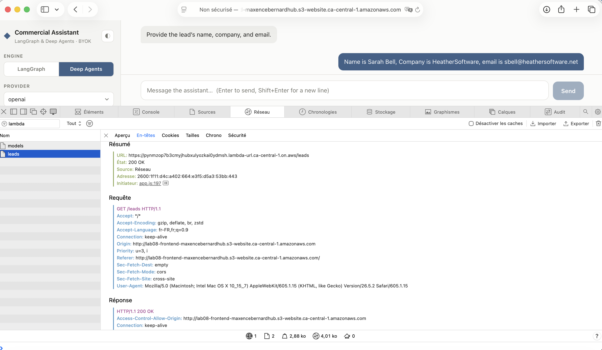
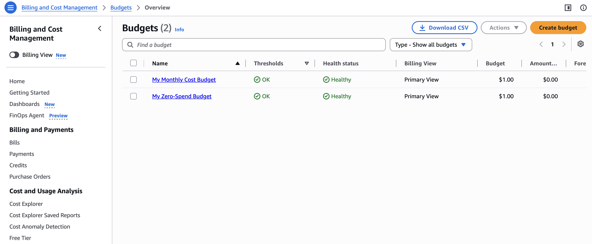

# Lab 08 — FastAPI + Docker + AWS

The **"notebook → production"** lab. It takes the commercial assistant agent from
[lab 06](../06_langgraph_deep_agents) — which lived in notebooks and a Streamlit app — and ships it
as a real product: a **stateless FastAPI service**, containerized, deployed to **AWS Lambda** behind
a public HTTPS endpoint, with its **static frontend hosted on S3**, running at a durable **~0 € cost**.

**Try it live** (bring your own LLM key — no key is stored server-side):

- **App** → <http://lab08-frontend-maxencebernardhub.s3-website.ca-central-1.amazonaws.com>
- **API docs (Swagger)** → <https://pynmzop7b3cmyjhubxulyozkai0ydmsh.lambda-url.ca-central-1.on.aws/docs>

> This is a demo deployment and **may be taken offline** (see
> [teardown](deploy/README.md#teardown--back-to-zero)). If the links are dead, the scripts in
> [`deploy/`](deploy/) rebuild the entire stack — image, Lambda, buckets, URL — in minutes.



---

## What this lab demonstrates

- **Agent → API.** The lab-06 agent (LangGraph **and** Deep Agents, both selectable) re-expressed as
  a **stateless** HTTP service — no server-side session, the client carries the conversation.
- **One image, two homes.** A multi-stage Dockerfile produces a single image that runs *identically*
  under `docker compose` locally and on **AWS Lambda** — thanks to the AWS Lambda Web Adapter, not a
  Lambda-specific code path.
- **Storage that fits the platform.** A `LeadStore` abstraction with three backends selected by env
  var: in-memory (tests), **PostgreSQL** (local Compose), **S3** (cloud). Same app, different
  persistence — *local stack ≠ serverless stack*.
- **BYOK security.** No LLM keys are deployed to the cloud. Callers supply their own via
  `X-LLM-API-Key`; the key is used in memory only, never logged, never persisted. The owner's LLM
  bill is **0 €** no matter how much the demo is used.
- **Real cloud engineering.** Least-privilege IAM, private vs public buckets, response streaming over
  a Function URL, CORS across origins, cost guardrails — all scripted with **Bash + AWS CLI**
  (no Terraform/CDK), and [documented step by step](deploy/README.md).

---

## The path from notebook to production

| Concern | Lab 06 (notebook / Streamlit) | Lab 08 (this lab) |
| --- | --- | --- |
| Interface | Streamlit app, local only | FastAPI service + static frontend, public URL |
| State | In-process, checkpointer, HITL `interrupt()` | **Stateless** — client sends the history; autonomous agent |
| Persistence | `data/leads.json` on disk | `LeadStore`: memory / PostgreSQL / **S3** |
| LLM keys | Server-side `.env` | **BYOK** in the cloud (`.env` only for local dev) |
| Email drafts | Written to `drafts/` | Returned **in the API response** |
| Runs on | Your laptop | **AWS Lambda** (container image) + **S3** |
| Cost | — | **~0 €** (always-free tier + BYOK + guardrails) |

The agent core was **copied and adapted** from lab 06 — lab 06 is left untouched and there is no
cross-lab import.

---

## Architecture

```text
LOCAL (your Mac)
┌──────────────────────────────────────────────────┐
│  source code + Dockerfile                        │
│        │  docker build --platform linux/arm64    │
│        ▼                                         │
│  container image (arm64)                         │
└───────────────────────┬──────────────────────────┘
                        │  docker push
                        ▼

AWS CLOUD (ca-central-1)
┌──────────────────────────────────────────────────┐
│  ECR — lab08-commercial-agent:latest             │
└───────────────────────┬──────────────────────────┘
                        │  Lambda pulls the image on cold start
                        ▼
┌──────────────────────────────────────────────────┐
│  Lambda function (container runtime)             │   ◀── public requests
│                                                  │       arrive here via the
│    Lambda Web Adapter (extension)                │       Function URL
│        │  replays the event as local HTTP        │       (HTTPS, streaming)
│        ▼                                         │
│    uvicorn → FastAPI app                         │
└───────────────────────┬──────────────────────────┘
                        │  boto3 (via the IAM execution role)
                        ▼
┌──────────────────────────────────────────────────┐
│  S3 — lab08-leads-… (private, holds leads.json)  │
└──────────────────────────────────────────────────┘

The static frontend is served from a second, public S3 bucket and calls the
Function URL cross-origin (CORS). See deploy/README.md for the full story.
```

```text
08_fastapi_docker_aws/
├── app/
│   ├── main.py                 # app factory + routes (health, models, invoke, stream, leads)
│   ├── config.py               # Settings, BYOK key resolution, get_llm() factory
│   ├── schemas.py              # Pydantic request/response models
│   ├── security.py             # BYOK header, optional bearer auth, rate limit, CORS
│   ├── domain.py               # statuses, transitions, new_lead()
│   ├── anthropic_compat.py     # streamed extended-thinking fix (see Key concepts)
│   ├── agents/
│   │   ├── langgraph_agent.py  # StateGraph, stateless (no HITL, no checkpointer)
│   │   ├── deep_agent.py       # create_deep_agent(..., interrupt_on={})
│   │   ├── tools.py            # build_tools(store) — 6 tools bound to a LeadStore
│   │   └── runner.py           # run() + astream() — parses reply/tool_calls/usage
│   └── storage/
│       ├── base.py             # LeadStore ABC + ListBackedStore
│       ├── memory_store.py     # tests
│       ├── postgres_store.py   # local (SQLModel; SQLite-compatible)
│       └── s3_store.py         # cloud (single JSON object)
├── frontend/                   # vanilla HTML/JS/CSS — no build step
├── deploy/
│   ├── deploy.sh               # ECR → IAM → S3 → Lambda → Function URL → concurrency
│   ├── frontend_deploy.sh      # frontend → S3 static website (+ URL injection)
│   └── README.md               # full deployment guide, gotchas, teardown
├── tests/                      # 98 tests, fake LLM, no API calls
├── Dockerfile                  # multi-stage, non-root, bundles the Lambda Web Adapter
├── docker-compose.yml          # api + postgres
└── data/seed_leads.json        # 8 fictitious demo leads
```

---

## API

| Method | Path | Purpose |
| --- | --- | --- |
| `GET` | `/health` | Liveness → `{"status":"ok"}` |
| `GET` | `/models` | `provider → [models]` + whether a server-side key exists (drives the BYOK field) |
| `POST` | `/invoke` | Run the agent, return `reply`, `tool_calls`, `leads_touched`, `email_draft?`, `usage` |
| `POST` | `/invoke/stream` | Same, as an **SSE** token stream + a final structured event |
| `GET` | `/leads` | List persisted leads (optional `?status=`) |
| `GET` | `/docs` | Auto-generated OpenAPI UI |

Request body: `{ engine, provider, model, messages[] }` — `engine` is `langgraph` or `deep_agents`.
Optional header `X-LLM-API-Key`. Errors: missing key → `401`, bad engine/provider/model → `422`,
provider failure → `502` (timeout → `504`).



---

## Running locally

**Requirements:** Python 3.13, [uv](https://docs.astral.sh/uv/), Docker.

LLM keys come from the **repository-root** `.env` (shared across labs — there is no lab-level
`.env`). With them present, BYOK is optional locally.

```bash
cd 08_fastapi_docker_aws
uv sync
uv run uvicorn app.main:app --reload      # → http://localhost:8000
```

Or the full stack (API + PostgreSQL), which is what the cloud image is built from:

```bash
docker compose up --build                 # → http://localhost:8000
```

Compose pins `LEAD_STORE=postgres`, so leads survive restarts in a real database (named volume).
Plain `uvicorn` defaults to `LEAD_STORE=memory`.

---

## Deploying to AWS

Everything is scripted and documented in **[`deploy/README.md`](deploy/README.md)** — account setup,
budgets, IAM, the two scripts, CORS verification, the gotchas we hit, and the teardown.

```bash
cd deploy
./deploy.sh preflight     # read-only: shows what would be created
./deploy.sh               # ECR → IAM → S3 → Lambda → Function URL → concurrency
./frontend_deploy.sh      # frontend → S3 static website
```

Both scripts are **idempotent**, take `--help`, and `deploy.sh` can run one stage at a time
(`./deploy.sh ecr`, `./deploy.sh iam`, …) — which is how the live deployment was actually done.

| **Lambda** — container image + public Function URL | **IAM** — least-privilege execution role |
| --- | --- |
|  |  |
| **S3** — `leads.json` persisted in the private bucket | **CORS** — the S3 page calling the Lambda API |
|  |  |

---

## Key concepts

### Stateless by design

Lambda is ephemeral: an instance may vanish between two requests. So the service keeps **no
conversation state** — the client sends the full `messages[]` every time, and the frontend persists
history in `localStorage`. Lab 06's HITL `interrupt()` gates are replaced by autonomous execution;
sensitive results (email drafts, touched leads) are surfaced in the structured response instead, and
the client re-invokes with new instructions if it wants changes.

### BYOK — bring your own key

Key resolution follows one path: **`X-LLM-API-Key` header > server-side env key > `401`**. Locally
the root `.env` supplies keys, so no header is needed. In the cloud **no LLM key is deployed at all**,
so the header is mandatory — visible in the UI as a *Required* badge, and in `/models` as
`server_keys: {anthropic: false, openai: false, google: false}`. The key is injected into the
LangChain client in memory and never logged or persisted.

### `LeadStore` — the same app on two different stacks

The store is an ABC with three implementations chosen by `LEAD_STORE`. Locally that is **PostgreSQL**
(a real database, a real container, a real volume). In the cloud a database would mean RDS — not
always-free, and a poor fit for a function that only lives for the length of a request — so the cloud
uses **S3**: one `leads.json` object, read and written with `boto3`. *Known limitation:* whole-object
read-modify-write means concurrent writers can clobber each other (last write wins). Fine for a demo;
a production system would use per-lead objects or DynamoDB.

### AWS Lambda Web Adapter (not Mangum)

Mangum wraps the ASGI app so it runs *differently* on Lambda than locally. The **Lambda Web Adapter**
is a binary extension baked into the image that runs the **same uvicorn** and replays Function URL
events as real local HTTP — identical runtime in both places, plus native **response streaming**,
which is what makes the SSE endpoint work in the cloud (`AWS_LWA_INVOKE_MODE=response_stream` +
Function URL `InvokeMode=RESPONSE_STREAM`).

### Streamed extended thinking (`anthropic_compat.py`)

Found while testing live: streaming a *tool-using* turn with `claude-sonnet-5` failed with
`messages.N.content.0.thinking.thinking: Field required`. Recent Claude models use adaptive extended
thinking whose reasoning text is `omitted`, so the streaming path rebuilds the block with a signature
but **no** `thinking` field, and replaying it on the next tool-loop turn is rejected.
`ThinkingSafeChatAnthropic` overrides the single payload choke point to backfill `thinking: ""` —
exactly what the non-streaming path already sends.

---

## Tests

```bash
uv run pytest                       # 98 tests, fake LLM, no API calls, no network
uv run pytest -m integration        # Postgres parity — needs `docker compose up db`
```

A custom `FakeToolCallingModel` (implementing `bind_tools`, `_generate` **and** `_stream`) drives both
engines, so the agent, streaming, and error paths are all covered without a key. Storage is tested
against memory, SQLite, and **moto**-mocked S3 with one parametrized contract suite.

---

## Cost

**~0 € durable**, by construction rather than by hope:

- **Always-free services only** — Lambda (1M requests + 400k GB-s/month) and S3 (5 GB), both
  indefinitely free within those caps.
- **BYOK** — the expensive part of an agent app (the LLM) is never billed to the owner.
- **Bounded compute** — the account's Lambda concurrency ceiling, plus a per-IP rate limit.
- **Two AWS Budgets** (zero-spend + 1 $/month) as an alarm — note that budgets *alert*, they do not
  block; AWS has no hard billing cap.



The only real charge is ECR image storage (~0.10 $/month), removed by the
[teardown](deploy/README.md#teardown--back-to-zero).
