# Deploying the Commercial-Agent API to AWS

This directory contains everything needed to deploy the lab-08 FastAPI service to
**AWS Lambda** (as a container image, behind a public **Function URL**) and to host
the static frontend on **S3**, at a durable **~0 € cost**.

- [`deploy.sh`](./deploy.sh) — build the Docker image, push it to ECR, and create/update
  the Lambda function, its IAM role, the leads S3 bucket, the public Function URL, and the
  reserved-concurrency cap.
- [`frontend_deploy.sh`](./frontend_deploy.sh) — publish `frontend/` to an S3 static-website
  bucket and point it at the live Function URL.

Read the two conceptual sections first (**Architecture** and **How local Docker connects to
AWS**); then follow the reproducible **Step-by-step** guide.

---

## Architecture

```text
LOCAL (your Mac)
┌──────────────────────────────────────────────────┐
│  source code + Dockerfile                        │
│        │  docker build --platform linux/arm64    │
│        ▼                                         │
│  container image (arm64)                         │
└───────────────────────┬──────────────────────────┘
                        │  docker push
                        │  (auth: aws ecr get-login-password | docker login)
                        ▼

AWS CLOUD (ca-central-1)
┌──────────────────────────────────────────────────┐
│  ECR — lab08-commercial-agent:latest             │
└───────────────────────┬──────────────────────────┘
                        │  Lambda pulls the image on cold start
                        ▼
┌──────────────────────────────────────────────────┐
│  Lambda function (container runtime)             │   ◀── public requests
│                                                  │       arrive here via the
│    Lambda Web Adapter (extension)                │       Function URL
│        │  replays the event as local HTTP        │       (HTTPS, streaming)
│        ▼                                         │
│    uvicorn → FastAPI app                         │
└───────────────────────┬──────────────────────────┘
                        │  boto3 (via the IAM execution role)
                        ▼
┌──────────────────────────────────────────────────┐
│  S3 — lab08-leads-… (private, holds leads.json)  │
└──────────────────────────────────────────────────┘
```

The **same container image** runs locally (via `docker compose`) and on Lambda. Nothing about
the application code changes between the two — only the environment variables differ
(`LEAD_STORE=postgres` locally, `LEAD_STORE=s3` in the cloud; no LLM keys in the cloud because
BYOK is enforced).

---

## How local Docker connects to AWS

The single artifact that travels from your laptop to the cloud is the **container image**.
Everything else is plumbing around getting that image to run and be reachable.

### 1. The image is the unit of deployment

`docker build` turns the app + its dependencies into a self-contained **image** — a frozen
filesystem plus a startup command (`uvicorn app.main:app`). This is exactly what runs in
Compose locally. We ship that same image to Lambda instead of a zip of Python files, so
"works on my machine" and "works on Lambda" are the same machine.

### 2. ECR is a private Docker registry inside AWS

Docker images live in **registries** (Docker Hub is the public one). **ECR** (Elastic Container
Registry) is AWS's private registry. Lambda can only run a container image if that image sits in
*your* ECR. So the flow is: `docker build` (local) → `docker push` to ECR → Lambda reads from ECR.

An ECR image address looks like:

```text
<account-id>.dkr.ecr.ca-central-1.amazonaws.com/lab08-commercial-agent:latest
└─account──┘         └──region──┘               └─────repository─────┘ └tag─┘
```

### 3. How Docker is allowed to push (the auth handshake)

Docker doesn't understand AWS credentials directly. So we run:

```bash
aws ecr get-login-password | docker login --username AWS --password-stdin <registry>
```

`aws ecr get-login-password` uses **your IAM user's credentials** (the ones from `aws configure`)
to mint a **temporary 12-hour password**. We pipe that into `docker login`. From then on,
`docker push` is authorized to upload to your ECR. This is the bridge between the Docker world
(username/password) and the AWS world (IAM credentials).

### 4. Two different identities — don't confuse them

| Identity | Who it is | When it is used | Permissions |
| --- | --- | --- | --- |
| **IAM user** `lab08-deployer` | *You*, deploying | On your laptop, running `aws`/`docker` | Broad: create ECR/Lambda/S3/IAM |
| **Execution role** `lab08-lambda-role` | *The Lambda function*, at runtime | Inside AWS, while a request runs | Minimal: read/write only the leads object in S3 |

The deployer *creates* the function; the execution role is what the function *becomes* while it
runs. The function never sees your keys — it assumes its role and gets temporary S3 permissions.

### 5. CPU architecture must match

Your Mac is **arm64** (Apple Silicon). We build with `--platform linux/arm64` and create the
Lambda with `--architectures arm64` (AWS Graviton) so the two match. Building an arm64 image and
running it on an x86 Lambda (or vice-versa) fails with an "exec format error". Building arm64 on an
arm64 Mac is also native (no slow emulation).

### 6. The Lambda Web Adapter — turning a web app into a Lambda

Lambda normally calls a function with a JSON *event* and expects a JSON *response*. Our app speaks
HTTP, not "Lambda events". The **AWS Lambda Web Adapter** (a small binary baked into the image as a
Lambda *extension*) bridges the two: it receives the Function URL's event, replays it as a **real
local HTTP request** to `uvicorn` on port 8000, and streams the HTTP response back out. That's why
the *same* uvicorn image runs identically locally and on Lambda — on Lambda the adapter feeds it
HTTP; locally Docker feeds it HTTP directly. For SSE we additionally set
`AWS_LWA_INVOKE_MODE=response_stream` so the adapter streams instead of buffering.

### 7. The Function URL — the public front door

A **Function URL** is a built-in HTTPS endpoint AWS attaches to a Lambda
(`https://<id>.lambda-url.ca-central-1.on.aws/`). With `--auth-type NONE` it's publicly
reachable (needed for an open demo), and with `--invoke-mode RESPONSE_STREAM` it can stream the
response body (needed for our SSE route). A separate `add-permission` call grants the "anyone"
principal the right to invoke it.

---

## What each stage of `deploy.sh` does

`deploy.sh` is split into idempotent stages. Run them one at a time (`./deploy.sh ecr`,
`./deploy.sh iam`, …) or all at once (`./deploy.sh`). Re-running a stage is always safe.

| Stage | What it creates / does | AWS service |
| --- | --- | --- |
| `preflight` | Checks `aws`/`docker` are present and you're authenticated; derives your account id and the image address. **Read-only.** | STS |
| `ecr` | Creates the private image repository, logs Docker in, **builds the arm64 image**, pushes it. | ECR |
| `iam` | Creates the Lambda **execution role**: a trust policy (only Lambda may assume it), CloudWatch Logs permission, and a least-privilege inline policy (read/write only the leads object). | IAM |
| `s3` | Creates the **private** leads bucket and fully blocks public access. | S3 |
| `lambda` | Creates (or updates) the function **from the container image**: arm64, 2048 MB, 120 s timeout, env `LEAD_STORE=s3` + `LEADS_BUCKET` + streaming flag + `CORS_ORIGINS`. No LLM keys (BYOK). | Lambda |
| `url` | Creates the public **Function URL** (HTTPS, `RESPONSE_STREAM`) and grants public invoke permission. | Lambda |
| `concurrency` | Caps the function at **5 concurrent executions** (cost guardrail). Non-fatal if the account's concurrency limit is too low. | Lambda |

### The request flow once deployed

```text
browser / curl
    │  HTTPS  ·  POST /invoke  ·  X-LLM-API-Key header (BYOK)
    ▼
Function URL  (auth NONE, RESPONSE_STREAM)
    │
    ▼
Lambda Web Adapter  ──replays it as a local HTTP request──▶  uvicorn → FastAPI app
                                                                 │
                                                                 │  boto3
                                                                 │  (via the execution role)
                                                                 ▼
                                                             S3 — leads.json
```

---

## The frontend: why host it on S3 when Lambda already serves it?

The container image bundles `frontend/`, so the Lambda **does** serve the UI at its root
(`https://<id>.lambda-url…/`). That is genuinely useful — it means one image gives you the whole
app locally (`docker compose up`) and a working URL in the cloud with zero extra steps. So why add
an S3 static-website bucket at all?

Because **serving static files from Lambda is the wrong tool for the job in production**:

- **No compute should be spent on static bytes.** Every HTML/CSS/JS request served by Lambda is a
  *function invocation* — it burns execution time (GB-s) and can pay a cold-start penalty. S3 serves
  files directly with **no compute, no cold start** — that is exactly what object storage is for.
- **Static serving would compete with the API for concurrency.** This account caps Lambda at 10
  concurrent executions. If page loads and asset fetches went through Lambda, they would eat into the
  same budget the actual API needs. S3 scales static content essentially without limit.
- **It is the canonical serverless full-stack pattern**: **S3 (static frontend) + Lambda (API)**.
  Demonstrating that split is part of the point of this lab — it is what a reviewer expects to see.

**The trade-off (honest):** an S3 *website* endpoint is **HTTP only** (`http://…s3-website…`). Full
HTTPS on a static bucket needs CloudFront in front (out of scope here — see the plan). The
Lambda-served copy is HTTPS, but it is not the right home for static assets. For this demo we host on
S3 (HTTP) to show the pattern; the HTTP page calling the HTTPS API is allowed by browsers (only the
reverse, HTTPS→HTTP, is blocked as mixed content).

### Why the frontend needs the API URL injected

When the browser loads the page **from S3**, "same origin" is the S3 bucket — *not* the Lambda. So the
page can no longer call the API with same-origin relative paths; it needs the **absolute Function URL**.
`frontend_deploy.sh` rewrites `window.API_BASE_URL` in `index.html` to the live Function URL before
uploading. And because the page (origin A = the S3 website) now calls the API (origin B = the Lambda)
**cross-origin**, the browser enforces **CORS**: the API must return
`Access-Control-Allow-Origin` for the S3 origin. That is why `deploy.sh` set the Lambda's
`CORS_ORIGINS` to exactly the S3 website origin — the two match by construction.

```text
browser
    │  1. loads the page
    ▼
origin A — the S3 website          http://lab08-frontend-….s3-website.ca-central-1.amazonaws.com
    │       (serves index.html, app.js, styles.css)
    │
    │  2. fetch(API_BASE + "/invoke")  ──▶  a cross-origin call (A → B)
    ▼
origin B — the Lambda Function URL  https://<id>.lambda-url.ca-central-1.on.aws
            the app's CORSMiddleware answers with
            Access-Control-Allow-Origin: <origin A>  ──▶  the browser allows it
```

## What `frontend_deploy.sh` does

| Step | What it does | Why |
| --- | --- | --- |
| Resolve URL | Reads the live Function URL from the Lambda (`get-function-url-config`) | No hard-coded URL — always current |
| Create bucket | Creates `lab08-frontend-…` (if missing) | Home for the static site |
| Make public | Disables the bucket's block-public-access **and** attaches a public `s3:GetObject` policy | A website bucket **must** be world-readable (contrast: the leads bucket stays fully private) |
| Website hosting | Enables S3 static website hosting (index + error = `index.html`) | Serves the SPA; unknown paths fall back to `index.html` |
| Inject + sync | Copies `frontend/` to a temp dir, rewrites `window.API_BASE_URL` to the Function URL, `s3 sync`s it | The S3-hosted page needs the absolute API URL (see above) |
| Print | Outputs the website URL + a CORS reminder | — |

> **Two buckets, two opposite policies — this is deliberate:** the **leads** bucket is *fully private*
> (only the Lambda role can read/write it); the **frontend** bucket is *fully public* (anyone can read
> the static files). Same service, opposite settings, because the data is sensitive and the website is
> not.

---

## Step-by-step (reproducible)

This is the exact path that produced the live deployment, from an account that did not exist yet.
Region used throughout: **`ca-central-1`** (Montréal). Every resource lives in that one region, so
teardown is a single-region job.

### 0. Local prerequisites

```bash
brew install awscli     # AWS CLI v2
aws --version
# Docker Desktop must be installed AND running (the build stage needs the daemon).
docker info >/dev/null && echo "docker ok"
```

### 1. Create the AWS account (Free Plan)

Go to <https://aws.amazon.com/> → **Create an AWS Account**. You will need an email, a phone (SMS
verification) and a **credit card** — AWS requires one even on the Free Plan, and may place a
temporary ~1 $ authorization to validate it (refunded automatically).

When asked to choose, pick the **free/Free Plan** option (the 2026 signup flow merges the account
type, support plan, and plan choice into a single question). This gives you:

- **Free Plan** credits (100–200 $ over 6 months), and
- **Basic support (0 $)** — never select Developer/Business, they are paid.

The credits are a safety net, not the plan: this lab targets the **always-free** allowances
(Lambda 1M requests + 400k GB-s/month, S3 5 GB), which stay free indefinitely.

> **The root user is for setup only.** Never create access keys for it, and never use it day to day.
> The next step creates a scoped IAM user for that.

### 2. Cost guardrails FIRST — before any resource

Console → **Billing and Cost Management** → **Budgets** → **Create budget**. Budgets are free (first
two) and **account-wide, not regional**. Create two:

| Budget | Template | Purpose |
| --- | --- | --- |
| Zero-spend | *Zero spend budget* | Emails you the moment spend exceeds **0.01 $** |
| 1 $ monthly | *Monthly cost budget*, amount **1** | The agreed cap, with alert thresholds |

⚠️ **Do not click "Upgrade plan"** in the cost widget — that moves you to the Paid Plan.

> **Budgets alert, they do not block.** AWS has **no hard billing cap**. Billing data lags up to
> ~24 h, so a budget is a smoke alarm, not a circuit breaker. The real protection in this lab is
> architectural: **always-free services**, **BYOK** (no LLM keys on the server → callers pay for
> their own LLM usage), and the account's **Lambda concurrency limit**. See *Cost model* below.

### 3. Create the IAM deployer user

Console → **IAM** (a *global* service — the region selector does not matter) → **Users** →
**Create user**.

1. Name: **`lab08-deployer`**.
2. **Leave "Provide user access to the AWS Management Console" unchecked** — this identity is for
   the CLI only, it needs no password.
3. Permissions → **Attach policies directly** → attach these five AWS-managed policies:

   | Policy | Needed for |
   | --- | --- |
   | `AmazonEC2ContainerRegistryFullAccess` | create the ECR repo, push the image |
   | `AWSLambda_FullAccess` | create the function, Function URL, concurrency |
   | `AmazonS3FullAccess` | create both buckets and write to them |
   | `IAMFullAccess` | create the Lambda **execution role** |
   | `CloudWatchLogsReadOnlyAccess` | read the function's logs when debugging |

4. Open the user → **Security credentials** → **Create access key** → use case **Command Line
   Interface (CLI)** → save the **Access key ID** and **Secret access key**.
   ⚠️ **The secret is shown once.** Store it in a password manager.

> `IAMFullAccess` is broad (it can create roles, so it is effectively admin-equivalent). That power
> is genuinely required to create the execution role. The meaningful controls here are: not using
> root, and **deleting these keys at teardown**. `AdministratorAccess` alone would be simpler but
> less explicit about what the deploy actually touches.

| The user — no console access, no MFA, CLI only | Its five attached policies |
| --- | --- |
| 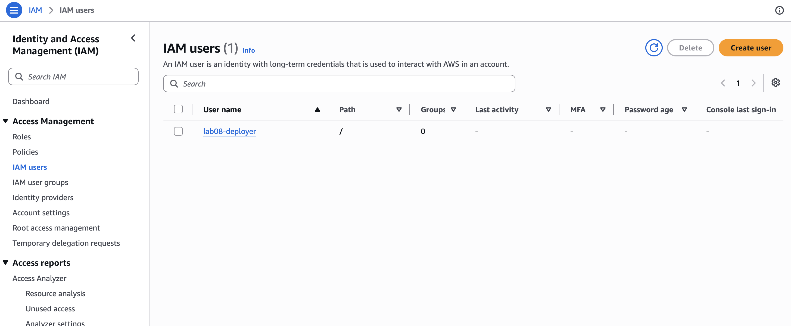 | 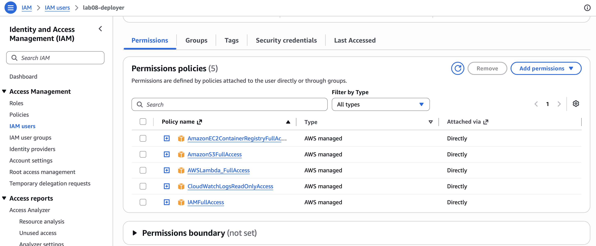 |

### 4. Configure the CLI

Run this **in your own terminal** so the secret never lands in a shell transcript or an agent
session:

```bash
aws configure
# AWS Access Key ID     : AKIA…
# AWS Secret Access Key : ………
# Default region name   : ca-central-1
# Default output format : json
```

It writes `~/.aws/credentials` (keys) and `~/.aws/config` (region, output). Every `aws` command —
and `boto3` — reads them automatically. Verify:

```bash
aws sts get-caller-identity
# → { "Account": "…", "Arn": "arn:aws:iam::…:user/lab08-deployer" }
```

### 5. Deploy the API

```bash
cd 08_fastapi_docker_aws/deploy
./deploy.sh --help          # stage list
./deploy.sh preflight       # read-only: identity + derived names, creates nothing
./deploy.sh                 # everything, in order
```

Stages are idempotent and can be run one at a time (`./deploy.sh ecr`, `./deploy.sh iam`, …), which
is the recommended way to do it the first time — you see exactly what each one creates. The final
output prints the **Function URL**. Smoke-test it:

```bash
curl https://<id>.lambda-url.ca-central-1.on.aws/health     # → {"status":"ok"}
```

The first call is a **cold start** (image pull + heavy imports): expect ~10–20 s. Later calls are
fast. On that first boot the app seeds the 8 demo leads into S3 (`leads.json`).

#### What each stage leaves behind, in the console

After **`ecr`** — the image exists locally under its ECR tag, and in the registry. Check the **Type**
column reads **`Image`**: that is the `--provenance=false` fix working (see *Gotchas*).

| Docker Desktop — the local image, tagged for ECR | ECR — the pushed image |
| --- | --- |
| 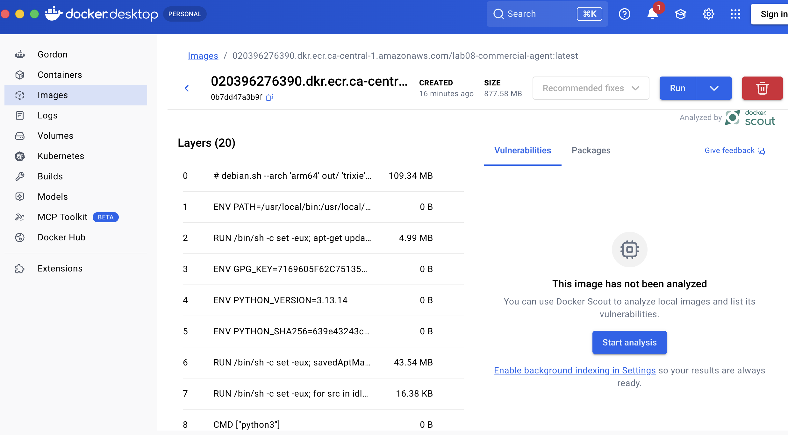 | 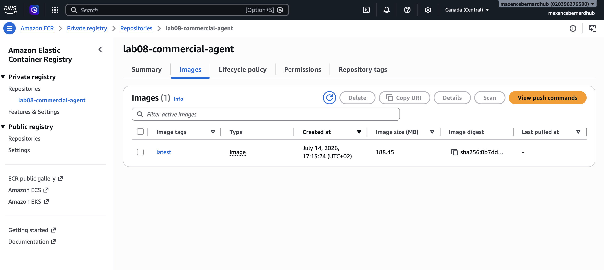 |

After **`iam`** — the execution role's *trust policy* answers "who may become this role?". After
**`s3`** — the leads bucket blocks **all** public access.

| The trust policy: only Lambda may assume the role | The leads bucket: fully private |
| --- | --- |
| 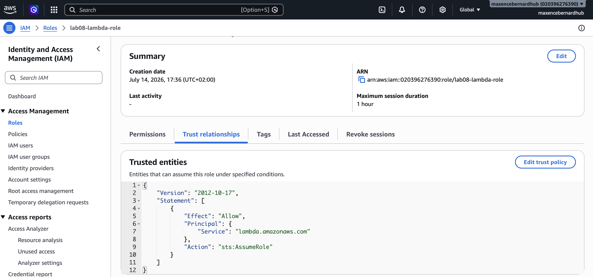 | 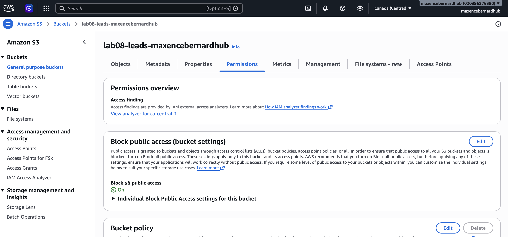 |

After **`lambda`** and **`url`** — note what is *absent* from the environment variables: **no LLM key**.
That is BYOK enforced. And the Function URL shows `NONE` + `RESPONSE_STREAM`, the two settings the SSE
endpoint depends on.

| Env vars — storage, streaming, CORS… and no LLM key | The Function URL: public + streaming |
| --- | --- |
| 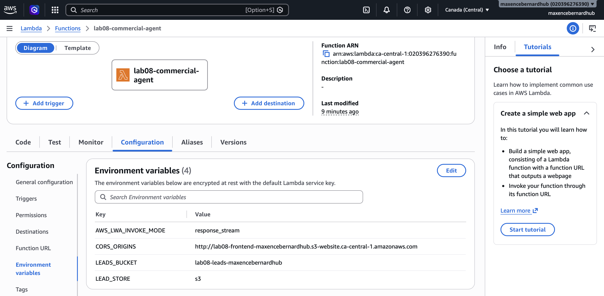 | 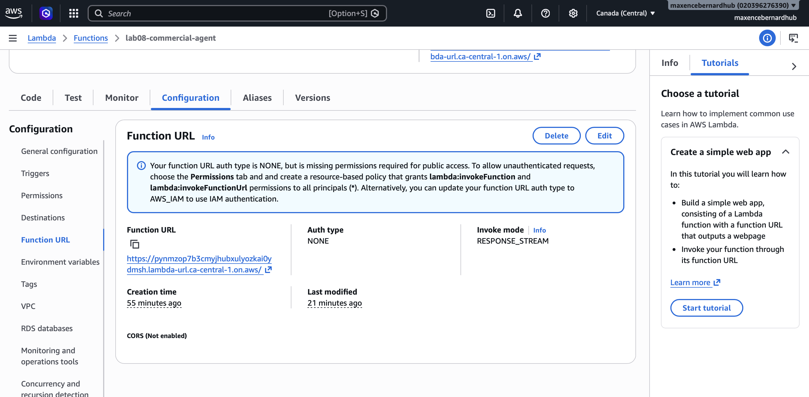 |

> The yellow "missing permissions required for public access" banner visible in that last screenshot
> is a **false alarm** — see *Gotchas* below. The live `curl` is the authority.

### 6. Deploy the frontend

```bash
./frontend_deploy.sh
```

It resolves the Function URL from the deployed Lambda, creates the public website bucket, injects
the URL into `index.html`, and syncs. It prints the **website URL**.

| Static website hosting enabled, with its endpoint | The three synced files |
| --- | --- |
| 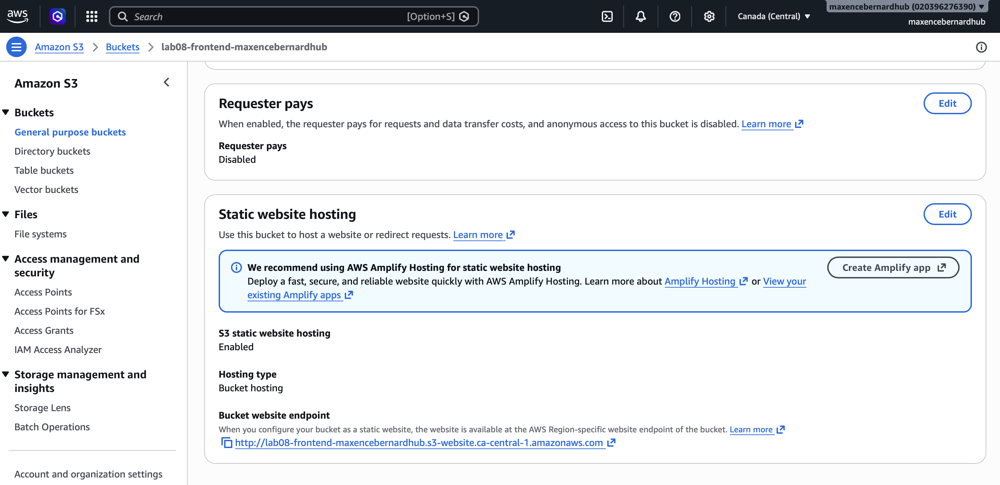 | 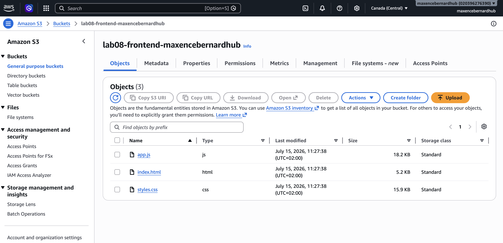 |

Compare this bucket's permissions with the leads bucket above — **public read here, fully blocked
there**. Same service, opposite settings, driven entirely by what the data is:

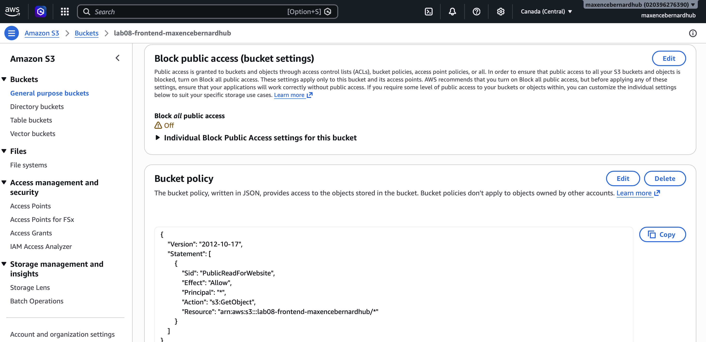

### 7. Verify CORS and the whole flow

The page is served from S3 and calls the API on Lambda, so this is a **cross-origin** request. Check
it without a browser:

```bash
SITE="http://lab08-frontend-<suffix>.s3-website.ca-central-1.amazonaws.com"
API="https://<id>.lambda-url.ca-central-1.on.aws"

curl -s -o /dev/null -w "%{http_code}\n" "$SITE"                    # 200 — site serves
curl -s "$SITE" | grep -o 'window.API_BASE_URL = "[^"]*";'          # URL injected
curl -s -D - -o /dev/null "$API/models" -H "Origin: $SITE" \
  | grep -i access-control-allow-origin                             # CORS allows the S3 origin
```

Then in the browser, open the website URL, paste an LLM key (BYOK), and send a prompt. In DevTools →
Network you should see requests going to the `…lambda-url…` host with `Sec-Fetch-Site: cross-site`
and an `Access-Control-Allow-Origin` response header naming the S3 origin.

The app on its first load, served from S3 — note the *Required* badge on the API key field: with no
server-side key deployed, BYOK is not optional in the cloud.

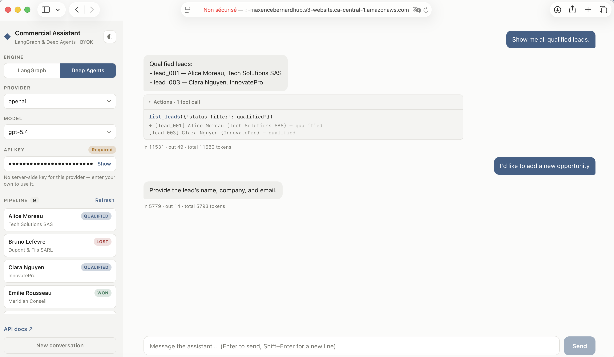

---

## Setting up a new machine (the account already exists)

You do **not** recreate the account, the budgets, the IAM user, or any AWS resource — only the local
tooling and credentials.

```bash
brew install awscli
aws configure          # region ca-central-1, output json
aws sts get-caller-identity
```

For the keys, pick one:

- **Reuse the existing keys** — copy `~/.aws/credentials` and `~/.aws/config` from the old machine
  (they are plain text files). Simplest if you still have them.
- **Create a second key pair** — IAM → Users → `lab08-deployer` → Security credentials → Create
  access key. An IAM user may hold **up to two** access keys, which is exactly what this is for. If
  you no longer need the old machine, **deactivate then delete** its key.

Docker Desktop is only needed if you intend to rebuild and push the image (`./deploy.sh ecr`).

---

## Gotchas we actually hit (and the fixes)

These all surfaced during the first real run. They are the reason the scripts look the way they do.

| Symptom | Root cause | Fix |
| --- | --- | --- |
| Lambda would have rejected the image (`media type … not supported`) | Docker buildx wraps images in an **OCI image index with provenance attestations** by default; Lambda needs a plain single-arch manifest | `docker build --provenance=false` (in `deploy.sh`). Verify in ECR: the image **Type** column must read **`Image`**, not *Image index* |
| Function crashed on boot: `Runtime.ExitError: exit status 1`; logs showed `AccessDenied … s3:ListBucket` on **GetObject** | The store reads `leads.json`, which does not exist on first boot. **Without `s3:ListBucket`, S3 returns 403 AccessDenied for a missing object instead of 404 NoSuchKey** (it hides object existence from callers that cannot list). The code only caught `NoSuchKey` → unhandled → uvicorn exited | Add `s3:ListBucket` on the **bucket** ARN (not the object ARN) to the execution role. `GetObject` + `PutObject` + `ListBucket` is the idiomatic S3 read/write policy |
| Function URL returned **403 Forbidden** instantly, although `AuthType=NONE` and the resource policy granted `lambda:InvokeFunctionUrl` to `*` | Since **October 2025**, a public Function URL requires **both** `lambda:InvokeFunctionUrl` **and** `lambda:InvokeFunction` in the resource policy | Add a second statement granting `lambda:InvokeFunction` to `*`. Note `--function-url-auth-type` is only accepted for `InvokeFunctionUrl`, so the second grant is unconditioned |
| Console keeps showing *"…is missing permissions required for public access"* even after the fix | Cosmetic. The console's banner heuristic does not recognise the permissions when they are split across **two separate statements** | Ignore it — trust the live response. `curl …/health` returning **200** is the authority, not the banner |
| `put-function-concurrency` refused | New accounts get an account-wide Lambda concurrency limit of **10**; reserving any amount would push unreserved below the required minimum | Not fatal, and not a problem: **the account limit itself caps concurrency**. `deploy.sh` warns and continues. On an account with a higher limit the reservation applies automatically |

---

## Cost model — why this stays at ~0 €

| Component | Cost |
| --- | --- |
| Lambda | Always-free: 1M requests + 400k GB-s per month, indefinitely |
| S3 (both buckets) | Always-free: 5 GB; the data here is a few KB |
| Function URL, IAM, Budgets (first 2) | Free |
| **LLM calls** | **0 € for you** — BYOK: no server-side keys, callers use their own |
| **ECR image storage** | The only real charge: roughly **~0.10 $/month** beyond the small free allowance. Covered by Free Plan credits, and removed by teardown |

Blast radius is bounded by: always-free services, the account's **10 concurrent execution** ceiling,
the app's per-IP rate limit, and **BYOK** (the expensive part of an agent app is never billed to you).

---

## Teardown — back to zero

Deletes everything this lab created, in dependency order. All in `ca-central-1`.

```bash
REGION=ca-central-1
FN=lab08-commercial-agent
ROLE=lab08-lambda-role
LEADS_BUCKET=lab08-leads-<suffix>
FRONTEND_BUCKET=lab08-frontend-<suffix>

# 1. Lambda (deleting the function also removes its Function URL config)
aws lambda delete-function --function-name "$FN" --region "$REGION"

# 2. CloudWatch log group (otherwise it lingers)
aws logs delete-log-group --log-group-name "/aws/lambda/$FN" --region "$REGION"

# 3. ECR repository + all images
aws ecr delete-repository --repository-name "$FN" --force --region "$REGION"

# 4. S3 buckets — must be emptied before they can be deleted
aws s3 rm "s3://$LEADS_BUCKET" --recursive
aws s3 rb "s3://$LEADS_BUCKET"
aws s3 rm "s3://$FRONTEND_BUCKET" --recursive
aws s3 rb "s3://$FRONTEND_BUCKET"

# 5. IAM execution role — detach/delete policies first, then the role
aws iam delete-role-policy --role-name "$ROLE" --policy-name lab08-s3-leads-rw
aws iam detach-role-policy --role-name "$ROLE" \
  --policy-arn arn:aws:iam::aws:policy/service-role/AWSLambdaBasicExecutionRole
aws iam delete-role --role-name "$ROLE"
```

Then, to fully decommission:

- **Delete the deployer's access keys** (IAM → Users → `lab08-deployer` → Security credentials →
  make each key *Inactive*, then Delete). Detach its five policies and delete the user if you are
  done with the lab entirely.
- **Delete the budgets** (Billing → Budgets → select → Actions → Delete), or keep them — they cost
  nothing and are a useful safety net if the account stays open.

Verify nothing is left:

```bash
aws lambda list-functions --region "$REGION" --query 'Functions[].FunctionName'
aws ecr describe-repositories --region "$REGION" --query 'repositories[].repositoryName'
aws s3 ls
aws iam list-roles --query "Roles[?starts_with(RoleName, 'lab08')].RoleName"
```

> **Free Plan note:** the account itself closes when the credits run out or the 6-month window ends,
> unless you upgrade to the Paid Plan. Tearing down the resources above is what keeps the bill at 0
> either way.
